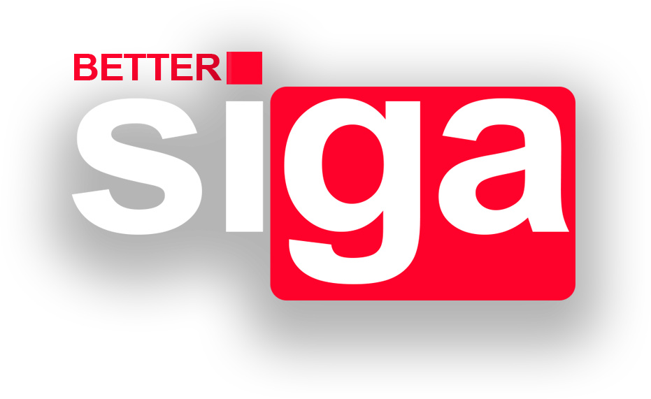

<h1 text-align="center">📚 ⟩ BetterSIGA ⟨ 📚</h1>

 
Uma implementação Front-End modernizada do SIGA, utilizando <u><b>TailwindCSS</b></u>.
BetterSIGA tem como intúito demonstrar uma interface fiel, porém mais moderna da UI atual do SIGA. 
  
Este projeto é uma <i>proof of concept</i>, e foi feito para eu treinar minhas habilidades com TailwindCSS. 
  

<h3 align="center"><b>⟨Nenhum funcionamento ainda está disponível (ainda!). Isto é apenas um conceito.⟩</b><h3>
 
 
